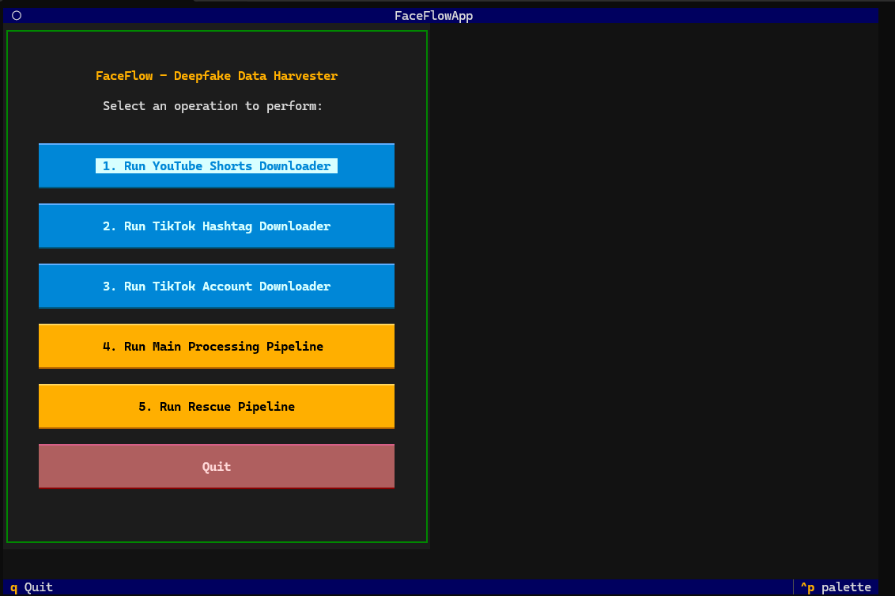
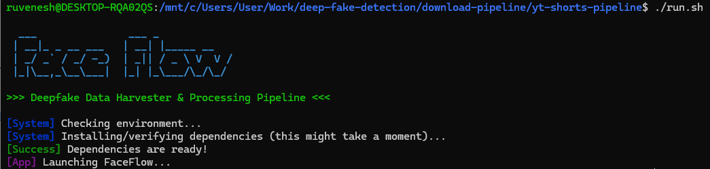

# FaceFlow - Deepfake Data Harvester




FaceFlow is a highly automated data harvesting and processing pipeline designed to source, process, and curate high-quality face-centric video datasets from platforms like YouTube and TikTok. It is optimized to support deepfake and face-swapping model training.

## Features

- **Automated YouTube Shorts Harvesting**: Rotate through topics to build vast datasets automatically.
- **Automated TikTok Harvesting**: Pull from specific hashtags or predefined creator accounts.
- **Strict Data Curation Pipeline**: 
  - Uses AI (`mediapipe`, `YOLOv8-face`) to spatially analyze and crop videos around a single talking head.
- **TUI (Text User Interface)**: Built with `Textual`, offering a clean and easy-to-use menu directly in your terminal.

## Installation

Ensure you have Python 3.10+ installed and a working CUDA environment (optional, but highly recommended for YOLO face detection speed).
You also need `ffmpeg` installed on your system path.

1. Clone this repository.
2. Install the required dependencies:
```bash
pip install -r requirements.txt
```

## Configuration

All configuration is managed via `config.yaml`.
You can customize:
- `limit_gb`: Total target dataset size in GB.
- `seed_keywords` and `topics`: Used for rotating searches.
- `hashtags`: Target hashtags for TikTok.

*Note: For YouTube, place your cookies in `cookies.txt` (Netscape format) to avoid bot detection.*

## Usage

For the easiest experience, use the included launcher scripts. They will automatically create a virtual environment, install the dependencies, and launch the TUI.

**For Linux/WSL:**
```bash
chmod +x run.sh
./run.sh
```

**For Windows:**
```cmd
run.bat
```

From the menu, you can trigger the downloaders or attempt to rescue multi-face rejected videos.
